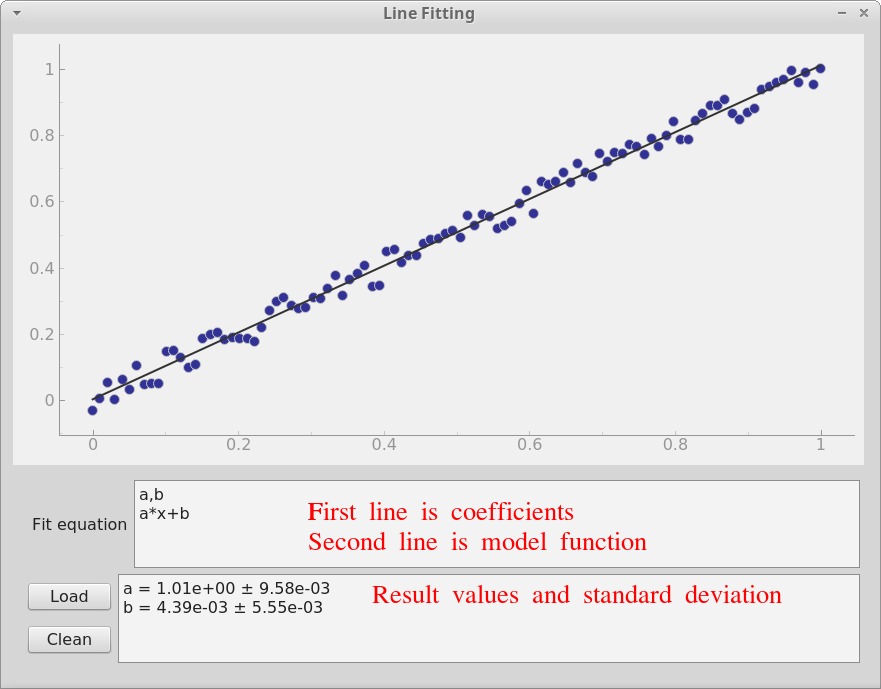
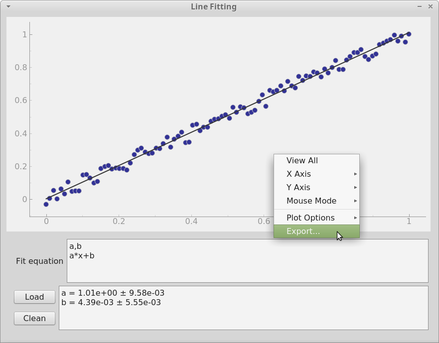

# Content

- [Content](#content)
- [Description](#description)
- [Prerequisites(for development)](#prerequisitesfor-development)
  - [Python modules](#python-modules)
- [Demonstration](#demonstration)
- [Compatibility](#compatibility)
- [To do list](#to-do-list)


# Description

This gui application allows to linear fit the two dimensional data(in csv, ods, xlsm or xlsx), showing the data and the fitting curve in the same window.
The program can output the plotting and save it.
It also can show the equation of the fitting curve.
The central idea of this program is to utilize function **optimize** in Python module **SciPy**.
For more information about the usage of **optimize** and **SciPy**, check [link](https://docs.scipy.org/doc/scipy/reference/generated/scipy.optimize.curve_fit.html)


# Prerequisites(for development)

## Python modules

The necessary Python modules are
- PyQt5
- numpy
- openpyxl
- pyexcel
- pyexcel-io
- pyexcel-ods
- pyexcel-xls
- pyexcel-xlsx
- pyqtgraph
- scipy


To install the above Python modules(except PyQt5), one can run
```console
$ pip install -r requirements.txt
```


For the installation of PyQt5 specifically, check [link](https://github.com/noctildon/linux-tutorial#install-pyqt5-in-virtualenv)


# Demonstration

In the upper text block, put the coefficients in first line.
The coefficients should follow the naming convention in Python otherwise they would not be valid.
Then put the model function next line.
The argument of model function must be x.
Operator and functions should also follow Python convention.
All Mathematical functions in [numpy](https://docs.scipy.org/doc/numpy-1.15.0/reference/routines.math.html)
are allowed to use.



One can export the image in window by right clicking the window.



One can use **test_data** to test the function of this program.

# Compatibility

The Python source code is only tested in Linux Mint 18.3.
But it should work in any OS installed required Python modules.


# To do list

- [ ] freeze the program into stand-alone executables, also tested on Windows, Linux and MacOS.
- [ ] add the feature of changing graph propeties(ex. color, width)